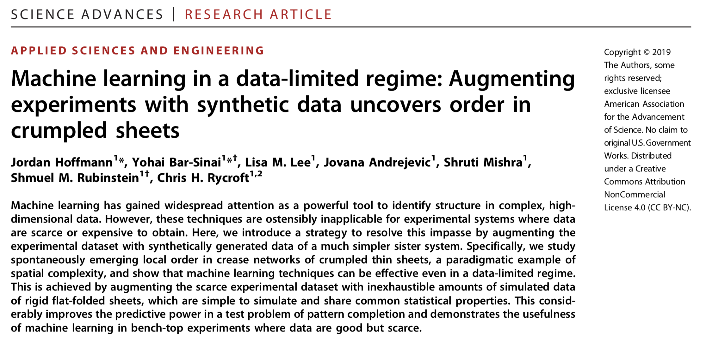

# Machine Learning in a data-limited regime: Augmenting experiments with synthetic data uncovers order in crumpled sheets
[*Jordan Hoffmann*](https://jhoffmann.org/),
[*Yohai Bar-Sinai*](https://yohai.github.io),
[Lisa Lee](https://projects.iq.harvard.edu/smrlab/people/lisa-lee),
Jovana Andrejevic,
Shruti Mishra,
[Shmuel M. Rubinstein](https://www.seas.harvard.edu/directory/shmuel), and
[Chris H. Rycroft](http://people.seas.harvard.edu/~chr/)

# Research Article
Preprint Available At: https://arxiv.org/abs/1807.01437
or, **Click on Image Below**
[](https://arxiv.org/pdf/1807.01437.pdf)
# Code Availability
Mathematica code for the neural network. Put everything in the same directory and unzip the zip folder. For more training data, contact Yohai or Shmuel.

Trained weights can be downloaded here:
https://www.dropbox.com/s/8ph0ll2l2u7ao0g/Trained_Weights_NI.wlnet?dl=0 


Flat folding code written in C++ by Chris H. Rycroft (chr@seas.harvard.edu). 
Uses voro++_2d see: http://math.lbl.gov/voro++/

Chris H. Rycroft, Voro++: A three-dimensional Voronoi cell library in C++, Chaos 19, 041111 (2009).

Code compiles on Ubuntu. Once compiled, generates `flatfold_gen` executable. Take four command line arguments:
`./flatfold_gen NUM_FOLDS RAND_SEED FRACTION_RADIAL_FOLD ALL_SAME_BOOL`
Where `NUM_FOLDS` is the number of folds, the `RAND_SEED` is the random seed, `FRACTION_RADIAL_FOLD` is a value between 0 and 100 for the fraction of folds that are inward folds. `ALL_SAME_BOOL` is whether or not to always fold in the same direction. 

Running the executable generates two .dat files and a `fold.gnuplot` script. The `fold.gnuplot` script, when run, generates a fold_fig.png that is used by the Mathematica code. A python (`run.py`) script allows you to customize options and generate figures. 
```bash
> mkdir images
> python run.py > run.sh
> sh run.sh
```
# Article Description
In the paper, we used tools from machine learning to try to understand the physics of crumpled sheets  of mylar. 
Using a laser, we scan the sheet to extract the heightmap. From the heightmap, we compute the mean curvature.

Below, we show an image of a rigid, flat-folded 
sheet along with a crumple sheet.
 Below, we show curvature maps from a flat-folded and crumpled sheet. The two images are not form the same sheets.

In the case of rigid flat folding, there are specific geometric rules that govern each vertex. Therefore, given either the ridges or the valleys, the location of
 the other can be inferred with near certainty. We asked to what degree this is true in crumpled sheets.
 Our goal is outlined below, where we try to train a network that is given the valleys to predict the distance from the nearest ridge.
  
We begin by testing whether we can capture both simulated and experimental flat folding. Using the code provided in this repository, `flatfold_gen.cc`, it is 
easy to generate random examples of flat-folded sheets. We trained on these, predicting the ridges given the valleys. However, when moving from generated data to experimental data, things didn't go too well. To try to help with this, we added noise to the generated data. Then, we showed we were able to make meaningful predictions on the experimental scans.
  
 From here, we wanted to ask to what extend we could make accurate predictions with crumpled sheets. However, with very limited data, we faced a large hurdle. 
 We had only ~500 scans that came from a total of 31 different experiments. Scans from the same experiment are very correlated, as the same sheet is repeatedly crumpled. Therefore, we augmented this small experimental set with computer generated sheets using the `flatfold_gen.cc` code in this respository. In the figure below, we ask by augmenting the training data from crumpled sheets with computer generated data from a simpler, sister system whether we can increase the performance. 
 
 We find that not only by increasing the amount of flat-folding data that is seen decreases the loss, we are able to get improved performance on multiple metrics (including Pearson correlation, an "accuracy", and a z-score (shown in SI)). We show that with different amounts of data, we get a slightly different _gestalt_ from our neural network. 
We wanted to ask to what degree this improved performance was due to our specific augmentation of a true physical system. To do this, we violated Kawasaki and Maekawa's rules of crumpled sheets. We randomly recolored vertices s.t. there was no longer a 3:1 ratio at each junction. We also perturbed the position of vertices such that alternate angles no longer summed to pi. Examples of such violated sheets are shown below.
 
We find, shown in panel B and C of the figure where we varied the fraction of flat folding data, that by violating these physical rules we deteriorate the performance of our predictions. 
Below, there is a gif where we violate Kawasaki's rule without causing interesections. We choose a violation approximately 10% the way through this video.

